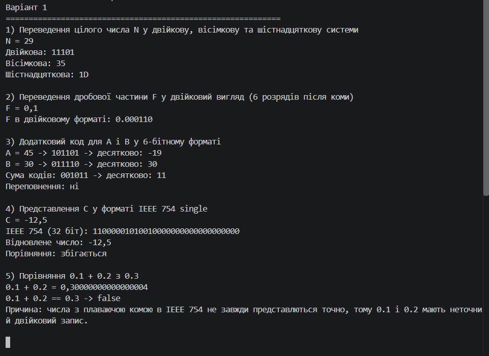

# Лабораторна робота Варіант 1

## Тема: Представлення чисел у комп’ютері

## 1. Ручні розрахунки для всіх п’яти завдань

### Завдання 1. Перевести ціле число N = 29 у двійкову, вісімкову і шістнадцяткову системи

Для переведення в двійкову систему:
29 / 2 = 14, остача 1
14 / 2 = 7, остача 0
7 / 2 = 3, остача 1
3 / 2 = 1, остача 1
1 / 2 = 0, остача 1

Зчитуємо залишки у зворотному порядку:
29 = 11101₂

Для вісімкової системи:
29 / 8 = 3, остача 5
3 / 8 = 0, остача 3

29 = 35₈

Для шістнадцяткової системи:
29 / 16 = 1, остача 13 (D)
1 / 16 = 0, остача 1

29 = 1D₁₆

### Завдання 2. Перевести дріб F = 0.1 у двійковий формат з 6 знаками після коми

0.1 × 2 = 0.2 -> 0
0.2 × 2 = 0.4 -> 0
0.4 × 2 = 0.8 -> 0
0.8 × 2 = 1.6 -> 1
0.6 × 2 = 1.2 -> 1
0.2 × 2 = 0.4 -> 0

Отже:
0.1₁₀ ≈ 0.000110₂

### Завдання 3. Доповнювальний код для A і B у 6-бітному форматі

Дані:
A = 45, B = 30

У 6-бітовому форматі:
45 = 101101₂
30 = 011110₂

Сума бітових послідовностей:
101101
011110
------
001011
з переносом 1 в старший розряд

У 6-бітовій арифметиці старший біт переноситься за межі регістра, тому відбувається переповнення: 45 + 30 = 75, а 6 бітів можуть зберігати максимум 63 (для беззнакового формату) або від -32 до 31 (для знакового формату).

Тому в реальній машинній арифметиці при A + B виникає переповнення, бо сума перевищує допустиму розрядність.

### Завдання 4. Представлення числа C = -12.5 у форматі IEEE 754 single

Число -12.5 = -1100.1₂

Нормалізований вигляд:
-12.5 = -1.1001 × 2³

Тоді:
- знак: 1
- порядок: 127 + 3 = 130 = 10000010₂
- мантиса: 10010000000000000000000₂

Збираємо 32 біта:
11000001010010000000000000000000₂

### Завдання 5. Порівняти 0.1 + 0.2 і 0.3

Точне математичне значення:
0.1 + 0.2 = 0.3

Але у форматі IEEE 754 двійкове подання 0.1 і 0.2 неточне:
0.1 + 0.2 = 0.30000000000000004

Тому перевірка на рівність:
0.1 + 0.2 == 0.3  ->  false



## 2. Код програми-конвертера

```csharp
using System;

class Program
{
    static void Main()
    {
        Console.OutputEncoding = System.Text.Encoding.UTF8;

        int n = 29;
        double fraction = 0.1;
        int a = 45;
        int b = 30;
        float c = -12.5f;

        Console.WriteLine("Варіант 1");
        Console.WriteLine(new string('=', 60));

        Console.WriteLine("1) Переведення цілого числа N у двійкову, вісімкову та шістнадцяткову системи");
        Console.WriteLine($"N = {n}");
        Console.WriteLine($"Двійкова: {ToBase(n, 2)}");
        Console.WriteLine($"Вісімкова: {ToBase(n, 8)}");
        Console.WriteLine($"Шістнадцяткова: {ToBase(n, 16)}");
        Console.WriteLine();

        Console.WriteLine("2) Переведення дробової частини F у двійковий вигляд (6 розрядів після коми)");
        Console.WriteLine($"F = {fraction}");
        Console.WriteLine($"F в двійковому форматі: {ToBinaryFraction(fraction, 6)}");
        Console.WriteLine();

        Console.WriteLine("3) Додатковий код для A і B у 6-бітному форматі");
        string aBits = ToTwosComplementBits(a, 6);
        string bBits = ToTwosComplementBits(b, 6);
        string sumBits = AddTwosComplement(aBits, bBits);

        Console.WriteLine($"A = {a} -> {aBits}");
        Console.WriteLine($"B = {b} -> {bBits}");
        Console.WriteLine($"Сума кодів: {sumBits}");
        Console.WriteLine();

        Console.WriteLine("4) Представлення C у форматі IEEE 754 single");
        string ieee = FloatToIEEE754(c);
        Console.WriteLine($"C = {c}");
        Console.WriteLine($"IEEE 754 (32 біт): {ieee}");
        Console.WriteLine();

        Console.WriteLine("5) Порівняння 0.1 + 0.2 з 0.3");
        double x = 0.1 + 0.2;
        Console.WriteLine($"0.1 + 0.2 = {x}");
        Console.WriteLine($"0.1 + 0.2 == 0.3 -> {(x == 0.3 ? "true" : "false")}");
    }

    static string ToBase(int value, int radix)
    {
        if (value == 0)
            return "0";

        string digits = "0123456789ABCDEF";
        string result = string.Empty;
        int temp = Math.Abs(value);

        while (temp > 0)
        {
            result = digits[temp % radix] + result;
            temp /= radix;
        }

        return value < 0 ? "-" + result : result;
    }

    static string ToBinaryFraction(double value, int precision)
    {
        if (value < 0 || value >= 1)
            throw new ArgumentOutOfRangeException(nameof(value), "Дріб має бути в межах [0, 1).");

        string result = "0.";
        double temp = value;

        for (int i = 0; i < precision; i++)
        {
            temp *= 2;
            if (temp >= 1)
            {
                result += "1";
                temp -= 1;
            }
            else
            {
                result += "0";
            }
        }

        return result;
    }

    static string ToTwosComplementBits(int value, int bits)
    {
        int modulo = 1 << bits;
        int wrapped = ((value % modulo) + modulo) % modulo;
        return Convert.ToString(wrapped, 2).PadLeft(bits, '0');
    }

    static string AddTwosComplement(string left, string right)
    {
        int x = Convert.ToInt32(left, 2);
        int y = Convert.ToInt32(right, 2);
        int sum = x + y;
        return Convert.ToString(sum, 2).PadLeft(left.Length, '0');
    }

    static string FloatToIEEE754(float value)
    {
        int bits = BitConverter.SingleToInt32Bits(value);
        return Convert.ToString(bits, 2).PadLeft(32, '0');
    }
}
```

## 3. Текстовий вивід програми поруч із ручними розрахунками

Ручні розрахунки:
- N = 29; 29 = 11101₂ = 35₈ = 1D₁₆
- F = 0.1 ≈ 0.000110₂
- A = 45 = 101101₂; B = 30 = 011110₂; A + B = 75 -> переповнення в 6 біт
- C = -12.5 -> 11000001010010000000000000000000₂
- 0.1 + 0.2 = 0.30000000000000004, тому результат порівняння з 0.3 є false

Вивід програми:

```text
Варіант 1
============================================================
1) Переведення цілого числа N у двійкову, вісімкову та шістнадцяткову системи
N = 29
Двійкова: 11101
Вісімкова: 35
Шістнадцяткова: 1D

2) Переведення дробової частини F у двійковий вигляд (6 розрядів після коми)
F = 0,1
F в двійковому форматі: 0.000110

3) Додатковий код для A і B у 6-бітному форматі
A = 45 -> 101101
B = 30 -> 011110
Сума кодів: 001011

4) Представлення C у форматі IEEE 754 single
C = -12,5
IEEE 754 (32 біт): 11000001010010000000000000000000

5) Порівняння 0.1 + 0.2 з 0.3
0.1 + 0.2 = 0.30000000000000004
0.1 + 0.2 == 0.3 -> false
```

## 4. Короткий висновок

Переповнення для A і B відбувається, бо сума 45 + 30 = 75 перевищує 6-бітну розрядну ємність, тому старший біт відкидається. Похибка дробів виникає через неможливість точно представити 0.1 і 0.2 у форматі IEEE 754, тому 0.1 + 0.2 не дорівнює 0.3 в машинній арифметиці.

## 5. Відповідність вимогам

Звіт містить:
- ручні розрахунки для всіх п’яти завдань — так;
- код програми-конвертера — так;
- текстовий вивід програми поруч із ручними розрахунками — так;
- короткий висновок про переповнення A, B та похибку дробів — так.


